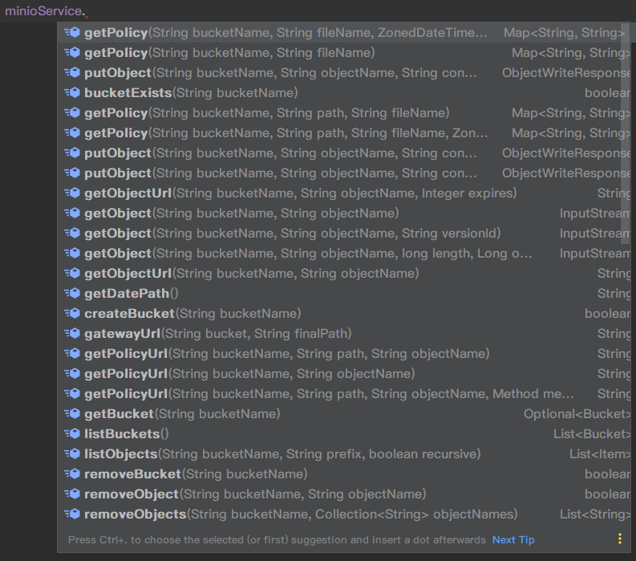

## 3.1.8.5.10

- 升级sdk到8.5.10版本

## 3.1.8.5.9

- 升级sdk到8.5.9版本

## 3.1.8.5.7

- 新增部分重载方法
- 配置文件解决重复扫描bean的问题
- 升级sdk到 8.5.7

## 3.0.10

- 新增 `initMultiPartUpload`，返回分片文件上传的初始化信息
- `initMultiPartUploadId` -> `getPresignedMultipartUploadUrls` 方法，支持一次性返回全部分片预签名地址，向下不兼容！！
- 新增 `getPresignedMultipartUploadUrlsByPartNumbers` 方法，支持根据分片 partNumber 获取对应的文件上传预签名地址
- 新增默认`bucketName`配置

## 3.0.9

- 修复组件bean扫描可能失败的问题
- 升级minio到 8.5.3 版本

## 3.0.8

- 升级minio到最新版本 8.5.2
- 部分代码优化

## 3.0.6

- 升级minio到最新版本 8.5.1

## 3.0.4

- 前端直传两个方法名优化

## 3.0.1

3.x 版本适配 spring boot 3.x，也可在spring boot 2.x中使用

- minio sdk版本升级到目前官方最新版 8.4.6
- 分片上传api调整以适配最新版sdk
- 修复分片上传无法合并成原文件的bug

## 1.0.1

- 默认内置三种bucket访问策略（只读，可读写，只写），新增设置桶策略方法 `setBucketPolicy`
- 支持创建bucket时指定bucket访问策略

## 1.0.0

- 首次封装，提供以下方法

 